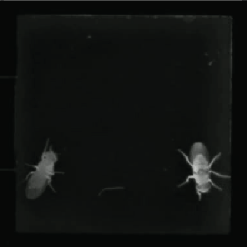
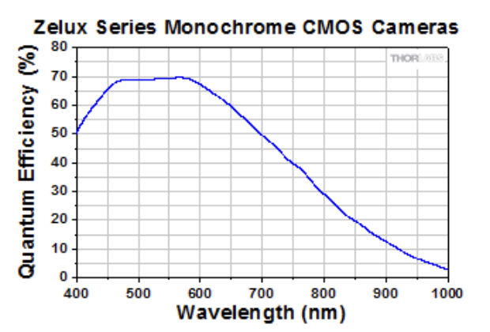
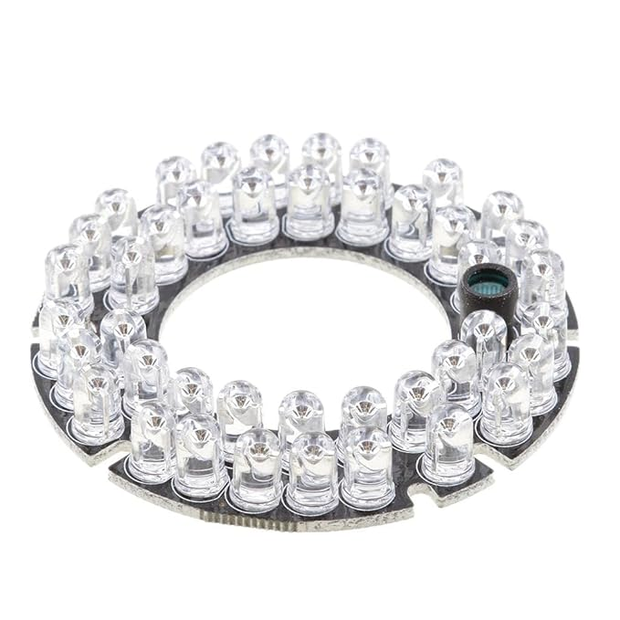
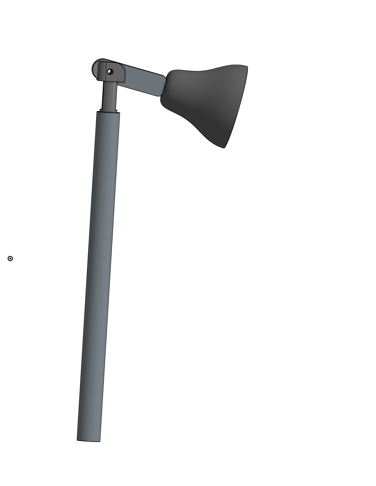

# Infrared Illumination System

Infrared (IR) illumination enables continuous behavioral tracking throughout experiments conducted in complete darkness. This ensures that flies navigate using only the controlled visual cues from the LED display, with no confounding ambient light or shadows.


*IR illumination*

---

## Design Philosophy

The original Ofstad et al. (2011) study used commercial infrared lighting (Smart Vision Lights) positioned to illuminate the arena uniformly. The key requirements are:
- **Wavelength**: >850 nm (invisible to *Drosophila*)
- **Intensity**: Sufficient for camera tracking without saturation
- **Uniformity**: Even illumination across arena surface
- **Directionality**: Minimize reflections from glass cover

Our implementation uses widely available IR LED arrays designed for CCTV security cameras. These generic modules provide excellent performance at minimal cost while meeting all experimental requirements.

---

## Why Infrared Illumination?

### Drosophila Spectral Sensitivity

*Drosophila* photoreceptors respond to wavelengths from approximately **300-600 nm**, with peak sensitivity around **480 nm** (blue-green light). They possess minimal sensitivity to wavelengths above **650 nm** and virtually no response beyond **700 nm**.

<figure style="text-align: center;">
  
  <figcaption>
    <em>
      Drosophila photoreceptor spectral sensitivity curves.
      Reproduced from Sharkey CR <em>et&nbsp;al.</em>,
      <strong>Scientific Reports</strong> 10, 18242 (2020).
    </em>
  </figcaption>
</figure>

**IR LED specifications**:
- **Peak emission**: 850 nm (far beyond fly visual range)
- **Bandwidth**: ±25 nm
- **Invisible to flies**: No behavioral response to IR illumination

**Scientific validation**: Salcedo et al. (1999) demonstrated that *Drosophila* rhodopsins have no measurable absorption above 700 nm, confirming that 850 nm IR light is completely invisible to flies. This ensures that:
1. Flies navigate using only the controlled LED display patterns
2. No shadows or IR intensity gradients provide unintended spatial cues
3. Experimental conditions match "dark" trials used in the original study

### Camera Detection

Standard CMOS and CCD camera sensors are sensitive to near-infrared wavelengths (up to ~1000 nm). Most consumer cameras include IR-blocking filters to produce natural-looking color images, but these filters can be removed or bypassed.


*Typical CMOS sensor spectral response showing sensitivity to 850 nm IR*

**Recommended cameras**:
- **USB webcams with IR filter removed**: Logitech C920, C922 (remove IR filter)
- **Machine vision cameras**: Point Grey Flea3, FLIR Blackfly S (no IR filter)
- **Raspberry Pi Camera Module**: NoIR version (no IR filter)
- **Any monochrome security camera** (inherently IR-sensitive)

---

## Hardware Configuration

### IR LED Array Module

**Component**: Generic 42-LED Infrared Illuminator Board


*42-LED IR array module commonly used for CCTV cameras*

**Specifications**:
- **LED count**: 42 individual IR LEDs
- **Wavelength**: 850 nm (some variants available at 940 nm)
- **LED type**: 5mm through-hole IR LEDs
- **Beam angle**: 45-60° (provides wide, diffuse coverage)
- **Power input**: 12V DC
- **Current draw**: 1-2A (varies by model and LED configuration)
- **Typical cost**: $5-15 USD (often salvaged from old security cameras)

**Why this module?**
- Readily available from electronics suppliers or salvage
- Pre-assembled with current-limiting resistors
- Designed for continuous operation
- 12V power matches Meanwell PSU output (shared with LED display)
- Provides adequate intensity for tracking 15 flies across ~20 cm diameter arena

### Power Supply

**Shared power architecture**:
```
Meanwell LRS-150-12 (12V, 12.5A)
    │
    ├── Buck Converter → 5V, 15A → P4 LED Panels
    │
    └── Direct 12V → IR LED Array (1-2A)
```

The IR array draws 1-2A from the 12V Meanwell power supply, which also powers the P4 LED display via a buck converter. Total load on the PSU:
- **P4 LEDs**: ~10-12A (after buck conversion from 12V)
- **IR array**: ~1-2A (direct 12V connection)
- **Total**: Well within 12.5A capacity of LRS-150-12

**Connection**:
- **Positive**: 12V rail from Meanwell PSU
- **Negative**: Common ground
- **Optional**: Inline fuse (2A) for overcurrent protection
- **Optional**: PWM dimming circuit for intensity control

---

## Mounting Configurations

Three mounting options are provided to accommodate different laboratory setups and fabrication capabilities. Each configuration achieves adequate overhead IR illumination for behavioral tracking.

### Option 1: 3D-Printed Stand with LED Holder

**Description**: A vertical stand printed in PLA or PETG with integrated mount for the IR LED array.


*3D-printed stand with top-mounted IR LED array*

**Advantages**:
- Custom-designed for optimal IR positioning
- Integrated cable management
- Adjustable height (design variants available)
- Stable base prevents tipping
- Can incorporate camera mount on same stand

**Disadvantages**:
- Requires 3D printer with ~20 cm Z-height
- Long print time (8-12 hours for tall stand)
- May require support structures during printing
- PLA can warp if exposed to heat from IR array

**Design files**: Available in `/cad/ir_mounting/3d_printed_stand/`

**Printing recommendations**:
- **Material**: PETG (better heat resistance than PLA)
- **Infill**: 15-20% (adequate strength without excessive material use)
- **Layer height**: 0.2-0.3 mm
- **Support**: Required for overhangs >45°
- **Post-processing**: Remove supports, sand contact surfaces


### Option 2: PVC Pipe Stand (Thrifted/Repurposed)

**Description**: A simple, cost-effective stand made from readily available PVC plumbing pipe with lamp shade attachment.


*PVC pipe stand with IR array mounted inside lamp shade*

**Components**:
- **Base**: PVC pipe (3/4" to 1" diameter, 20-30 cm length)
- **Shade**: Small lamp shade or funnel (to house IR array)
- **Mounting**: Hose clamps, zip ties, or 3D-printed adapter
- **Base weight**: Sand-filled PVC cap or metal washer for stability

**Advantages**:
- **Extremely low cost**: Often free from salvaged materials
- **No 3D printing required**
- **Quick assembly**: 10-15 minutes
- **Adjustable height**: Cut pipe to desired length
- **Sturdy**: PVC pipe provides excellent rigidity

**Disadvantages**:
- Less aesthetically refined than custom 3D prints
- Requires lamp shade sourcing (thrift stores, old fixtures)
- Cable management not integrated (requires separate clips)

**Assembly instructions**:

1. **Prepare base**:
   - Cut PVC pipe to 25-30 cm length
   - Attach end cap to bottom
   - Fill with sand or gravel for stability (optional but recommended)

2. **Attach IR array**:
   - Secure IR LED board inside lamp shade using zip ties or hot glue
   - Route power cable through shade and down pipe
   - Use hose clamp to secure shade to top of PVC pipe

3. **Positioning**:
   - Place stand at arena edge or suspend over center
   - Angle IR array to illuminate arena uniformly
   - Secure cable to prevent accidental disconnection


### Option 3: 3D-Printed Clip-On Mount (Attaches to P4 LED Panels)

**Description**: A compact clip-on mount that attaches directly to the top edge of P4 LED panels, eliminating the need for separate stands.


**Advantages**:
- **Minimal footprint**: No floor space required
- **Quick printing**: Small part (~30-60 minutes)
- **Secure attachment**: Clips firmly to panel frame
- **Adjustable angle**: Pivoting design allows IR aiming
- **Multiple units possible**: Attach to several panels for improved uniformity

**Disadvantages**:
- IR array closer to arena periphery (may create uneven illumination)
- Weight may tilt lightweight LED panels
- Cable routing more complex with multiple units

**Design files**: Available in `/cad/ir_mounting/clip_on_mount/`

**Recommended use**:
- Attach 2-3 IR arrays on opposite sides of arena for even coverage
- Angle IR arrays toward center to minimize shadows
- Use with heavier-mounted LED panels for stability

---

## Illumination Uniformity

### Positioning Strategy

**Goal**: Achieve uniform IR illumination across the entire arena surface without creating bright spots or shadows that could provide unintended spatial cues.

**Best practices**:
1. **Height**: Position IR array 30-50 cm above arena center
2. **Angle**: Aim directly downward or with slight tilt (<15°)
3. **Diffusion**: Use diffuser material (frosted acrylic sheet) if hot spots occur
4. **Multiple sources**: Use 2-3 IR arrays from different angles for better uniformity

### Testing Illumination Quality

**Visual inspection with IR-sensitive camera**:
1. Set up camera in tracking position (overhead view)
2. Activate IR illumination
3. Display camera feed on monitor
4. Check for:
   - **Overexposure** (white/saturated areas): Reduce IR intensity or increase camera exposure distance
   - **Underexposure** (dark areas): Move IR closer or use additional IR arrays
   - **Shadows**: Reposition IR to minimize shadowing from arena walls
   - **Reflections from glass**: Angle IR slightly off-perpendicular to reduce glare

**Quantitative uniformity testing**:
```python
# Simple Python script to analyze IR illumination uniformity
import cv2
import numpy as np

# Capture frame from camera
cap = cv2.VideoCapture(0)
ret, frame = cap.read()

# Convert to grayscale
gray = cv2.cvtColor(frame, cv2.COLOR_BGR2GRAY)

# Extract arena region of interest (ROI)
arena_roi = gray[y1:y2, x1:x2]

# Calculate mean and standard deviation
mean_intensity = np.mean(arena_roi)
std_intensity = np.std(arena_roi)

# Uniformity metric: coefficient of variation
cv = std_intensity / mean_intensity

print(f"Mean intensity: {mean_intensity:.1f}")
print(f"Std deviation: {std_intensity:.1f}")
print(f"Uniformity (CV): {cv:.3f}")

# Good uniformity: CV < 0.15 (15% variation)
```

---

## Camera Configuration

### IR Filter Removal (USB Webcams)

Many consumer webcams have an IR-blocking filter that must be removed for optimal IR sensitivity.

**Procedure** (example for Logitech C920):
1. **Disassemble camera**: Remove screws from camera housing
2. **Access lens assembly**: Carefully separate lens from PCB
3. **Locate IR filter**: Small glass disk between lens and sensor
4. **Remove filter**: Gently pry out IR filter (may be glued in place)
5. **Reassemble**: Replace lens assembly without IR filter

**Note**: This modification voids warranty and may cause color distortion in visible light. Use modified cameras exclusively for IR tracking.

**Alternative**: Purchase NoIR (No Infrared filter) cameras:
- Raspberry Pi Camera Module v2 NoIR
- ELP USB cameras with IR sensitivity

### Camera Settings for Tracking

**Recommended settings**:
- **Resolution**: 640×480 or 1280×720 (adequate for tracking 15 flies)
- **Frame rate**: 30 fps minimum (higher fps improves tracking accuracy)
- **Exposure**: Manual mode, adjust to prevent overexposure
- **Gain**: Moderate (increase if image too dark, decrease if noisy)
- **White balance**: Disabled (irrelevant for monochrome IR imaging)
- **Focus**: Manual, focused on arena surface

**Software**: CTRAX (Caltech Multiple Fly Tracker) or similar tracking software

---

## Troubleshooting

### Issue: Uneven illumination across arena

**Possible causes**:
- IR array too close to arena
- Single-point illumination creating shadows
- Reflections from glass cover

**Solutions**:
- Increase height of IR array (40-50 cm recommended)
- Use multiple IR arrays positioned around arena perimeter
- Tilt IR arrays slightly off perpendicular to reduce glass reflections
- Add diffuser material between IR and arena

### Issue: Camera image too dark

**Possible causes**:
- IR array insufficient intensity
- Camera exposure too low
- IR filter not fully removed from camera

**Solutions**:
- Verify 12V power supply to IR array
- Increase camera exposure time in software
- Check that IR filter removal was successful

### Issue: Camera image overexposed/saturated

**Possible causes**:
- IR array too bright
- Camera gain too high
- IR array too close to arena

**Solutions**:
- Reduce IR intensity via PWM dimming circuit
- Lower camera gain setting
- Increase distance between IR array and arena


## Bill of Materials (IR Illumination System)

| Component | Quantity | Approximate Cost (USD) |
|-----------|----------|------------------------|
| 42-LED IR Array (850 nm, 12V) | 1-3 | $5-15 each |
| Power cable (18-22 AWG) | 2m | $2-5 |
| Inline fuse holder + 2A fuse | 1 | $2-3 |
| **Mounting Option 1**: 3D-printed stand | | |
| - PLA/PETG filament (~200g) | | $4-8 |
| **Mounting Option 2**: PVC pipe stand | | |
| - PVC pipe (3/4", 30cm) | 1 | $1-2 |
| - Lamp shade (thrifted) | 1 | $2-5 |
| - Hose clamps, zip ties | - | $2-3 |
| **Mounting Option 3**: Clip-on mount | | |
| - PLA/PETG filament (~30g) | | $1-2 |
| **Optional**: PWM control | | |
| - MOSFET (IRLZ44N) | 1 | $1-2 |
| - Resistors, wire | - | $1-2 |
| **Total** (basic setup) | | **~$10-25** |

*Specialized behavioral tracking IR illumination systems can cost $200-500. This generic approach achieves equivalent functionality at ~5-10% of the cost.*

## CAD Files

All 3D models for IR mounting options are available in the `/cad/ir_mounting/` directory:
- `/cad/ir_mounting/3d_printed_stand/` - Full-height stand design
- `/cad/ir_mounting/clip_on_mount/` - P4 LED panel clip-on design

STL files ready for slicing, along with source STEP/F3D files for customization.

---

## Recommended Configuration Summary

**For most laboratories**, we recommend:
- **2× IR LED arrays** positioned on opposite sides of arena
- **Mounting**: PVC pipe stands (fastest, cheapest) or 3D-printed stands (cleanest)
- **Height**: 35-45 cm above arena surface
- **Angle**: Aimed at arena center
- **Camera**: Modified Logitech C920 or Raspberry Pi NoIR camera

This configuration provides excellent tracking performance with minimal cost and setup time.
