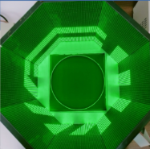
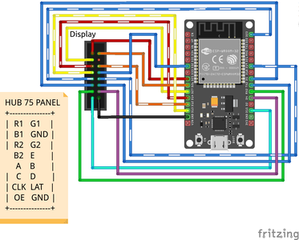

# Visual Display System (P4 LED Panels)

The visual display provides the spatial landmarks that flies use for place navigation. Our implementation uses consumer-grade P4 LED panels with custom firmware, achieving the same visual functionality as specialized modular displays at a fraction of the cost.


*Eight P4 LED panels arranged to create 360° panoramic visual environment*

---

## Design Rationale

The original Ofstad et al. (2011) arena used a custom 24×192 LED display system specifically designed for insect behavioral neuroscience. While these modular systems offer excellent performance, they can cost $2,000-5,000 and require proprietary control hardware.

Our approach leverages the fact that *Drosophila* visual requirements are well-understood and can be met by carefully selected commercial LED panels. By using HUB75-compatible P4 panels with ESP32-based control, we achieve:
- Adequate spatial resolution for fly vision
- Sufficient brightness and contrast
- Precise pattern generation
- Full software control via open-source libraries
- Total display cost of ~$80-120 instead of $2,000-5,000

---

## Why Flies Can See P4 LED Displays

### Drosophila Visual System Capabilities

*Drosophila melanogaster* possesses compound eyes with approximately 750 ommatidia (individual visual units) per eye. Understanding their visual capabilities is essential for validating that P4 LED displays provide adequate stimuli.

#### Spatial Resolution

**Interommatidial angle**: The angular separation between adjacent ommatidia in *Drosophila* is approximately **5-8 degrees** in the frontal visual field (Götz, 1964; Land, 1997).

**Nyquist criterion for visual stimuli**: To be clearly resolved, visual patterns should have spatial frequencies below the Nyquist limit, requiring features separated by at least **2× the interommatidial angle**, or ~10-16 degrees.

**P4 LED panel specifications**:
- **Pixel pitch**: 4mm (center-to-center distance between LEDs)
- **Viewing distance in arena**: ~8-10 cm (typical fly position to arena wall)
- **Angular subtense**: tan⁻¹(4mm / 100mm) ≈ **2.3 degrees** per pixel

With 8× P4 panels (64 pixels × 32 pixels each) arranged in a circle:
- **Total horizontal pixels**: 512 pixels (8 panels × 64 pixels)
- **Angular resolution**: 360° / 512 pixels ≈ **0.7 degrees per pixel**

**Conclusion**: Each pixel subtends ~2.3° from typical viewing distance, and patterns are separated by multiple pixels. This is **well within the spatial resolution capabilities** of the fly visual system (which resolves ~5-8° features). Flies can clearly discriminate the vertical, horizontal, and diagonal bar patterns used in the original study.

#### Temporal Resolution (Flicker Fusion)

**Critical flicker fusion frequency** in *Drosophila*: ~200-250 Hz (Heisenberg & Wolf, 1984)

**P4 LED refresh rate with ESP32-HUB75-MatrixPanel-DMA library**:
- **Typical refresh rate**: >200 Hz per panel with DMA implementation
- **Effective rate with 8 chained panels**: >180 Hz (depends on ESP32 configuration)

The display refresh rate exceeds the flicker fusion frequency of *Drosophila*, ensuring flies perceive stable, non-flickering visual stimuli. This is critical because flickering displays could introduce confounding visual cues or cause stress.

#### Brightness and Contrast

**Fly photoreceptor sensitivity**: *Drosophila* R1-R6 photoreceptors respond to wavelengths from ~350 nm (UV) to ~600 nm, with peak sensitivity around 480 nm (blue-green) (Salcedo et al., 1999).

**P4 LED panel specifications**:
- **RGB LEDs**: Red (~620 nm), Green (~525 nm), Blue (~470 nm)
- **Brightness**: 800-1200 cd/m² (adjustable via PWM)
- **Contrast ratio**: >1000:1

Flies detect green and blue wavelengths effectively, allowing them to see the visual patterns. The high contrast ratio ensures clear figure-ground separation, essential for discriminating vertical vs. horizontal bars.

---

## Hardware Configuration

### Panel Specifications

**Display type**: P4 Indoor RGB LED Matrix Panel (HUB75 compatible)


**Key specifications per panel**:
- **Resolution**: 64 pixels (W) × 32 pixels (H)
- **Pixel pitch**: 4mm
- **Physical dimensions**: 256mm × 128mm
- **LED type**: SMD2121 RGB
- **Brightness**: 800-1200 cd/m²
- **Refresh rate**: Passive scanning (1/16 scan)
- **Interface**: HUB75E (standard 16-pin ribbon cable)
- **Power**: 5V DC, 1.5-2A per panel (maximum brightness)

**Total system**: 8 panels arranged in circular configuration
- **Total resolution**: 512 × 32 pixels (horizontal wraparound)
- **Arena coverage**: Complete 360° panorama
- **Total power requirement**: 5V, 12-16A (maximum brightness)

### Control Hardware: ESP32 Microcontroller

**Microcontroller**: ESP32 DevKit V1 or equivalent
- **Processor**: Dual-core Xtensa LX6, 240 MHz
- **RAM**: 520 KB SRAM (critical for DMA buffering)
- **GPIO**: 34 pins (16+ required for HUB75 interface)
- **DMA support**: Yes (essential for flicker-free refresh)

**Why ESP32?**
1. **Sufficient processing power**: Dual-core CPU handles simultaneous display refresh and pattern generation
2. **DMA capability**: Direct Memory Access allows continuous display refresh without CPU intervention
3. **Adequate RAM**: 520 KB SRAM accommodates frame buffers for 512×32 display
4. **Cost-effective**: $5-10 per board
5. **Extensive community support**: Well-documented libraries and examples

### HUB75 Interface

HUB75 is a standard parallel interface for LED matrix panels, using 16 pins:


*HUB75 connector pinout and signal descriptions*

**Signal definitions**:
- **R1, G1, B1**: Upper half RGB data (first 8 rows)
- **R2, G2, B2**: Lower half RGB data (next 8 rows)
- **A, B, C, D**: Row address selection (4 bits = 16 rows max)
- **CLK**: Pixel clock (shift data into panel)
- **LAT**: Latch signal (transfer shift register to display)
- **OE**: Output enable (PWM brightness control)
- **GND**: Ground reference

The ESP32 GPIO pins connect directly to these signals, allowing bit-banged or DMA-driven control of the panel shift registers.

---

## Software Implementation

### ESP32-HUB75-MatrixPanel-DMA Library

We use the open-source **ESP32-HUB75-MatrixPanel-DMA** library developed by Mrfaptastic:

**Repository**: https://github.com/mrcodetastic/ESP32-HUB75-MatrixPanel-DMA

**Key features**:
- **DMA-driven refresh**: Uses ESP32 I2S peripheral with DMA for continuous, flicker-free updates
- **Double buffering**: Allows drawing to back buffer while displaying front buffer
- **Chaining support**: Drive multiple panels as single virtual display (up to 64 panels tested)
- **Brightness control**: Global brightness adjustment via PWM
- **High refresh rates**: Achieves >200 Hz refresh with optimized configuration

### Installation and Setup

```cpp
// Install via Arduino Library Manager or PlatformIO
// Search: "ESP32 HUB75 LED MATRIX PANEL DMA Display"

#include <ESP32-HUB75-MatrixPanel-I2S-DMA.h>

// Configuration for 8 chained panels (512 × 32 pixels)
#define PANEL_WIDTH 64
#define PANEL_HEIGHT 32
#define PANELS_NUMBER 8
#define PIN_E -1 // Not used for 1/16 scan panels

// Pin mapping (example - adjust for your wiring)
HUB75_I2S_CFG mxconfig(
  PANEL_WIDTH,   // Module width
  PANEL_HEIGHT,  // Module height
  PANELS_NUMBER, // Chain length
  {
    HUB75_I2S_CFG::FM6126A, // Optional: driver chip type
    25, 26, 27, // R1, G1, B1
    14, 12, 13, // R2, G2, B2
    23, 19, 5, 18, // A, B, C, D row select
    15, // CLK
    32, // LAT
    33, // OE
    22  // E (optional, -1 if not used)
  }
);

// Create display object
MatrixPanel_I2S_DMA *dma_display = nullptr;

void setup() {
  // Initialize display
  dma_display = new MatrixPanel_I2S_DMA(mxconfig);
  dma_display->begin();
  dma_display->setBrightness8(128); // 50% brightness
  dma_display->clearScreen();
}
```

### Visual Pattern Generation

The experimental paradigm requires displaying vertical, horizontal, and diagonal bar patterns that rotate with the cool tile position.

```cpp
// Draw vertical bar pattern (15-degree bars)
void drawVerticalBars() {
  int barWidth = 21; // 15° ≈ 21 pixels
  int spacing = 21;   // Even spacing
  
  for (int x = 0; x < 512; x++) {
    if ((x / barWidth) % 2 == 0) {
      for (int y = 0; y < 32; y++) {
        dma_display->drawPixel(x, y, dma_display->color565(255, 255, 255));
      }
    }
  }
}

// Rotate pattern by shifting pixel offset
void rotatePattern(int angle) {
  int pixelOffset = (angle * 512) / 360; // Convert degrees to pixels
  // Redraw pattern with offset (implementation depends on pattern type)
}

// Synchronize visual pattern with cool tile position
void updateVisualLandscape(int coolTileQuadrant) {
  int rotationAngle = coolTileQuadrant * 90; // Quadrants: 0°, 90°, 180°, 270°
  rotatePattern(rotationAngle);
}
```

### Pattern Synchronization with Thermal Control

**Critical requirement**: The visual display and cool tile position must remain coupled throughout the experiment (Fig. 1c in Ofstad et al.).

```cpp
// Coordinate thermal and visual systems
void repositionCoolTile(int newQuadrant) {
  // Update thermal control (activate different set of 4 Peltier plates)
  thermalController.setCoolTileQuadrant(newQuadrant);
  
  // Rotate visual display to match
  updateVisualLandmark(newQuadrant);
  
  // Ensure both updates complete before next trial
  delay(100);
}
```

---

## Power Supply

### Voltage Regulation

**Input**: 12V from Meanwell PSU (shared with IR illumination)
**Output**: 5V regulated for LED panels
**Method**: Buck converter module

**Buck converter specifications**:
- **IC**: LM2596, XL4015, or equivalent
- **Input**: 12V DC (from Meanwell LRS-150-12)
- **Output**: 5V DC, adjustable via potentiometer
- **Current capacity**: Minimum 15A (for 8 panels at full brightness)
- **Efficiency**: ~85-92% typical

**Configuration**:
1. Connect 12V input from Meanwell PSU
2. Adjust output voltage to exactly 5.0V using multimeter
3. Verify voltage under load (with panels connected)
4. Add output capacitors (1000-2200µF) for stability

### Power Distribution

**Power requirements per panel** (maximum brightness):
- Typical: 1.5A at 5V
- Peak (all white): 2A at 5V

**Total system** (8 panels):
- Typical: 12A at 5V
- Peak: 16A at 5V

**Recommended supply capacity**: 15-20A buck converter at 5V

**Wire gauge**: Use at least 16 AWG (1.3mm²) wire for power distribution to minimize voltage drop over cable length.

### Shared Power Architecture

```
Meanwell LRS-150-12 (12V, 12.5A)
    │
    ├── Buck Converter → 5V, 15A → P4 LED Panels (8×)
    │
    └── Direct 12V → IR LED Array (1-2A)
```

---

## Physical Configuration

### Panel Mounting

The 8× P4 panels are arranged in a circular or octagonal configuration surrounding the arena, creating a continuous 360° panoramic display.

**Design considerations**:
- **Panel angle**: Panels mounted vertically, facing inward toward arena center
- **Viewing distance**: 8-12 cm from arena center to LED surface
- **Panel alignment**: Minimize gaps between adjacent panels for visual continuity
- **Cable management**: Ribbon cables connect panels in series (daisy-chain)

**Mounting options**:
1. **3D-printed frame**: Custom designed brackets (CAD files in `/cad/led_mounts`)
2. **Laser-cut acrylic**: Simple slot-together design
3. **Aluminum extrusion**: Modular T-slot frame (e.g., 2020 profile)

### Cable Chain


Panels connect in series via HUB75 ribbon cables:
```
ESP32 → Panel 1 → Panel 2 → Panel 3 → ... → Panel 8
```

Each panel has:
- **Input connector**: Receives data from previous panel (or ESP32)
- **Output connector**: Passes data to next panel

**Best practices**:
- Use short ribbon cables (<30 cm) to minimize signal degradation
- Ensure all cables are firmly seated in connectors
- Test each panel individually before assembling full chain
- Shield cables if experiencing electromagnetic interference

---

## Calibration and Testing

### Display Uniformity

Test procedure:
1. Display solid white pattern across all panels
2. Verify brightness uniformity (use light meter if available)
3. Adjust individual panel brightness via software if needed
4. Check for dead pixels or color inconsistencies

### Pattern Accuracy

Verify that visual patterns match original study specifications:
- **Bar width**: 15° ≈ 21 pixels
- **Bar spacing**: Even distribution across 360° panorama
- **Pattern rotation**: 90° increments align correctly with quadrants

### Refresh Rate Verification

Use a camera or oscilloscope to verify >180 Hz refresh rate:
- Point smartphone camera at display
- If rolling bands are visible, refresh rate is too low
- Adjust ESP32 DMA configuration to increase refresh frequency

---


## Cost of Materials (Display System)

| Component | Quantity | Approximate Cost (USD) |
|-----------|----------|------------------------|
| P4 Indoor RGB LED Panel (64×32) | 8 | $60-100 |
| ESP32 DevKit V1 | 1 | $5-10 |
| LM2596 Buck Converter (15A) | 1 | $8-15 |
| HUB75 Ribbon Cables (30cm) | 8 | $8-16 |
| Power distribution wire (16 AWG) | 3-5m | $5-10 |
| Mounting hardware (screws, brackets) | - | $10-20 |
| **Total** | | **~$96-171** |

Comparable modular LED display systems designed for behavioral neuroscience cost $2,000-5,000. This implementation achieves equivalent visual functionality at ~5% of the cost.

---


## CAD Files and Code

All 3D models for LED panel mounts and arena frames are available in the `/cad` directory. Complete ESP32 firmware with pattern generation code is available in `/firmware/visual_display`.

Example patterns and calibration utilities are provided in `/software/display_calibration`.
