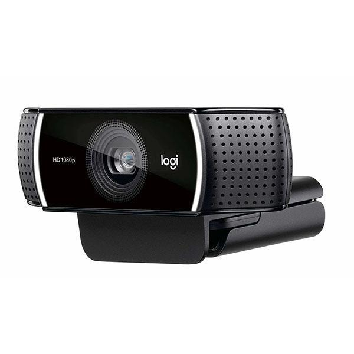
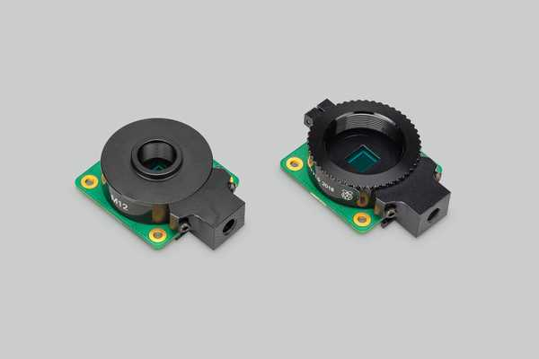

# Monochrome Camera Selection Guide

Choosing the right camera for behavioral tracking depends on your tracking method and budget. This guide explains why monochrome cameras are preferred, what resolution you actually need, and provides specific recommendations for different use cases.

*Comparison of tracking performance across different camera types and resolutions*

---

## Why Monochrome Cameras?

### Advantages Over Color Cameras

**1. Higher sensitivity**:
- Monochrome sensors capture ALL photons (no Bayer filter color mask)
- ~2-3× more sensitive in low light conditions
- Critical for IR illumination (850 nm has lower intensity than visible light)

**2. Better resolution**:
- Each pixel records full intensity (not interpolated from color neighbors)
- True 1920×1080 means 1920×1080 actual measurements
- Color cameras interpolate ~75% of pixel data (demosaicing artifacts)

**3. Lower noise**:
- Simpler sensor design = less read noise
- Better signal-to-noise ratio for tracking algorithms
- Cleaner background subtraction

**4. No color processing overhead**:
- Faster frame rates at high resolution
- Lower CPU usage for tracking software
- Simpler image processing pipeline

*Color sensors waste ~75% of photons due to color filters; monochrome sensors capture all light*

### When Color Cameras Are Acceptable

For **basic experiments with CTRAX**, even a color camera works if:
- IR illumination is bright enough
- Flies are clearly visible against background
- You're willing to sacrifice some sensitivity

**Many researchers successfully use color webcams** (Logitech C920, C922) by:
- Removing IR blocking filter
- Increasing IR illumination
- Converting to grayscale in software

---

## Resolution Requirements by Tracking Method

### CTRAX (Centroid Tracking)

**Minimum acceptable**: 640×480 (VGA)  
**Recommended**: 1280×720 (720p)  
**Optimal**: 1920×1080 (1080p)

**Why CTRAX doesn't need ultra-high resolution**:

The original Ofstad et al. (2011) study used **standard definition cameras** and achieved excellent results with CTRAX. The algorithm only needs:
- Fly clearly distinguishable from background (5-10 pixels diameter minimum)
- Consistent blob detection across frames
- Sufficient spatial resolution to see fly movement

**Example calculation** (1280×720 camera):
- Arena diameter: ~20 cm
- Pixels across arena: ~800 pixels (if well-framed)
- Pixel size: 20 cm / 800 px = **0.25 mm/pixel**
- Fly body length: ~3 mm
- Fly in image: 3 mm / 0.25 mm/px = **12 pixels**

**12 pixels is more than adequate** for centroid detection and ellipse fitting.

**Conclusion**: For CTRAX tracking, **inexpensive 720p or 1080p cameras are completely sufficient**. Higher resolution provides no meaningful improvement in tracking accuracy.

### SLEAP (AI Pose Tracking)

**Minimum acceptable**: 1920×1080 (1080p)  
**Recommended**: 2560×1440 (2K) or higher  
**Optimal**: 3840×2160 (4K)

**Why SLEAP benefits from high resolution**:

SLEAP detects **individual body part keypoints** (head, thorax, abdomen tip), requiring:
- Fine anatomical detail visible in each frame
- Minimum 3-5 pixels per body part for neural network detection
- Clear separation of overlapping flies

**Example calculation** (1920×1080 camera):
- Arena diameter: ~20 cm
- Pixels across arena: ~1200 pixels
- Pixel size: 20 cm / 1200 px = **0.17 mm/pixel**
- Fly head width: ~0.5 mm
- Head in image: 0.5 mm / 0.17 mm/px = **~3 pixels**

**3 pixels is marginal** for reliable keypoint detection. The neural network may struggle to distinguish head from thorax.

**With 4K camera** (3840×2160):
- Pixels across arena: ~2400 pixels
- Pixel size: **0.08 mm/pixel**
- Fly head: 0.5 mm / 0.08 mm/px = **~6 pixels**

**6 pixels is much better** - SLEAP can reliably detect individual body parts and maintain identity through occlusions.

*keypoint detection quality at different resolutions*

**Conclusion**: For SLEAP tracking with 15 flies in a 20 cm arena, **2K or 4K cameras are strongly recommended**. 1080p is possible but may struggle with keypoint accuracy.

---

## Camera Recommendations

### Budget-Friendly Options (CTRAX Tracking)

#### 1. Modified USB Webcam

**Logitech C920 / C922** (with IR filter removed)

*Popular choice: Logitech C920 with IR filter removed*

**Specifications**:
- Resolution: 1920×1080 @ 30 fps
- Sensor: Color CMOS (converts to grayscale in software)
- IR sensitivity: Good after filter removal
- Focus: Manual focus ring (essential for arena use)
- Connection: USB 2.0
- **Cost**: $50-80 USD

**Pros**:
- Widely available
- Easy to modify (many tutorials online)
- Reliable drivers (works with CTRAX immediately)
- Good lens quality
- Manual focus control

**Cons**:
- Color sensor (not ideal, but adequate)
- Fixed lens (cannot change viewing angle)
- Some light falloff at edges

**Best for**: Laboratories starting with CTRAX, limited budget, standard experimental setup.

#### 2. Raspberry Pi Camera NoIR

**Raspberry Pi HQ Camera (NoIR version)**

*Raspberry Pi HQ Camera with C/CS-mount lens*

**Specifications**:
- Resolution: 4056×3040 (12 MP) @ 10 fps, 1920×1080 @ 30 fps
- Sensor: Sony IMX477 (color, but no IR filter)
- IR sensitivity: Excellent (designed for IR imaging)
- Lens: Interchangeable C/CS mount
- Connection: Raspberry Pi CSI ribbon cable
- **Cost**: $50 (camera) + $25-75 (lens) = $75-125 USD

**Pros**:
- Native IR sensitivity (no modification needed)
- Interchangeable lenses (adjust field of view)
- High resolution available
- Integrates with Raspberry Pi setup
- Good image quality

**Cons**:
- Requires Raspberry Pi (not standalone USB)
- Color sensor (though better than webcam)
- Need to select appropriate lens

**Recommended lens**: 6mm or 8mm focal length for ~30 cm working distance

**Best for**: Setups already using Raspberry Pi, flexibility in lens selection.

## Image Quality Factors Beyond Resolution

### 1. Frame Rate

**CTRAX**: 30 fps is sufficient (flies walk slowly, ~1-2 cm/s)

**SLEAP**: 30-60 fps recommended
- Higher frame rate improves pose estimation
- Reduces motion blur
- Better temporal resolution for behavior analysis

**High-speed analysis** (>60 fps): Only needed for specialized kinematics studies (wing movements, grooming), not standard place learning.

### 2. Shutter Type

**Rolling shutter** (consumer cameras):
- Rows of pixels exposed sequentially
- Can cause "jello effect" with fast motion
- Acceptable for walking flies (slow movement)

**Global shutter** (industrial cameras):
- All pixels exposed simultaneously
- No motion artifacts
- Better for precise tracking, but more expensive

**Recommendation**: Rolling shutter is fine for place learning experiments. Global shutter is a luxury, not a necessity.

### 4. Lens Quality

**Important factors**:
- **Focal length**: 6-12 mm typical for 30-50 cm working distance
- **Aperture**: f/1.4 to f/2.8 (lower = more light, shallower depth of field)
- **IR correction**: Some lenses have chromatic aberration in IR (focus shift)

**Recommendation**: C-mount lenses designed for "day/night" security cameras are IR-corrected and inexpensive ($25-75).

---

## Practical Recommendations by Use Case

### Case 1: "I'm replicating the original Ofstad et al. study with CTRAX"

**Recommended camera**: **Logitech C920** (modified, IR filter removed)

**Why**:
- Original study used similar resolution
- CTRAX doesn't benefit from higher resolution
- Proven, reliable, widely used
- Easy to set up and use

**Total cost**: ~$50-80

### Case 2: "I want the best CTRAX tracking performance"

**Recommended camera**: **ELP 1080p Monochrome USB** (global shutter)

**Why**:
- True monochrome sensor (best IR sensitivity)
- 60 fps (smoother tracking)
- Global shutter (cleaner frames)
- Still affordable

**Total cost**: ~$80-120

### Case 3: "I'm implementing SLEAP for this Mphasis-funded AI project"

**Recommended camera**: **See3CAM_CU135M (4K monochrome)** OR **FLIR Blackfly S (5MP)**

**Why**:
- SLEAP needs high resolution for keypoint detection
- 4K provides adequate pixel density (6-8 pixels per fly head)
- True monochrome maximizes image quality
- See3CAM = budget option, FLIR = professional option

**Total cost**: 
- Budget: $200-300 (See3CAM)
- Professional: $500-800 (FLIR + lens)

### Case 4: "I'm on a tight budget but want to try SLEAP"

**Recommended camera**: **Raspberry Pi HQ Camera NoIR** with 6mm lens

**Why**:
- Can capture high resolution (4K) at 10-15 fps
- 1080p at 30 fps for real-time
- Integrates with Raspberry Pi control system
- No IR filter modification needed

**Caveat**: Color sensor is suboptimal, but workable with sufficient IR illumination

**Total cost**: ~$75-125

---

## Setup Optimization

### Camera Mounting

**Height above arena**: 40-60 cm (adjust based on lens focal length)

**Goal**: Frame arena with minimal dead space
- Arena should fill ~80% of frame
- Leave ~10% margin on edges for fly excursions

**Focus**: Set to infinity if arena is far enough, or carefully adjust manual focus

**Exposure**: Manual mode
- Adjust so flies are clearly visible (bright pixels)
- Background should be gray (not black or white)
- Avoid overexposure (saturated pixels)

*Proper camera framing: arena fills most of frame with small margin*

### Lighting Optimization

**For lower-resolution cameras** (720p, 1080p):
- Use 2-3 IR LED arrays for even illumination
- Increase IR brightness to compensate for lower sensitivity

**For high-resolution cameras** (2K, 4K):
- Can use less IR illumination (more sensitive)
- Focus on uniformity rather than intensity

---
