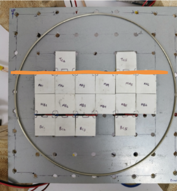
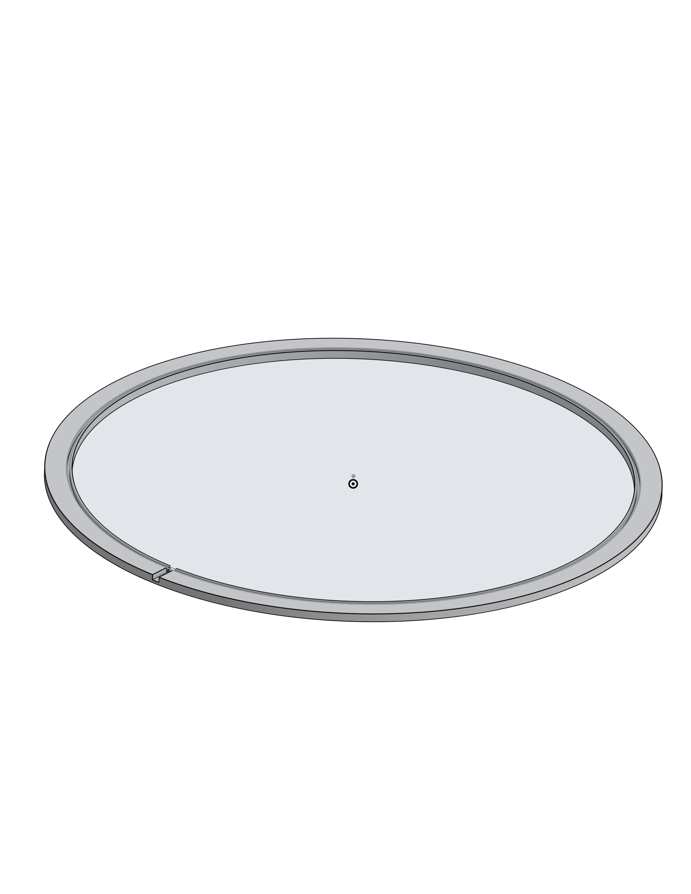

# Thermal Control System

The thermal control system creates the temperature landscape that drives place learning behavior in Drosophila Melanogaster. Our current implementation uses a dual-subsystem approach: bulk thermal control for the warm background and precision PID control for the cool target tile.


*Complete thermal control system showing both bulk and precision subsystems*

---

## Design Philosophy

Previous builds used 64 individually addressable 1-inch thermoelectric modules from Oven Industries, providing precise but expensive thermal control. Our implementation achieves the same behavioral outcomes using commercially available Peltier plates and simplified control electronics, dramatically reducing both initial cost and ongoing maintenance expenses.

The key insight is that the experimental paradigm only requires two distinct temperatures: a uniformly warm background (36°C) that flies avoid, and a single cool tile (25°C) that serves as the safe target. This allows us to separate bulk heating from precision cooling, optimizing each subsystem independently.

---

## Bulk Thermal Subsystem

### Hardware Configuration

The bulk thermal subsystem consists of **60 generic Peltier plates** arranged beneath the arena floor, providing uniform warming across the experimental surface.


*64-plate Peltier array configuration for uniform background heating*

**Key Specifications:**
- **Peltier modules**: Generic TEC1-12706 or equivalent (40mm × 40mm)
- **Operating voltage**: ~30V DC
- **Power supply**: High-current DC supply (recommendation: 30V, 15-20A minimum)
- **Control method**: Simple on/off switching via relay or solid-state switch
- **Thermal target**: 36°C uniform surface temperature

### Operating Principle

All 60 plates are wired in series-parallel configuration and powered simultaneously to create the warm background. Unlike the original implementation, individual addressability is not required since all background tiles maintain the same temperature throughout the experiment.

The Peltier modules operate in heating mode only (current flows in one direction), simplifying the power electronics and eliminating the need for H-bridge drivers in this subsystem.

### Thermal Performance


The bulk array achieves thermal uniformity within ±1°C across the arena surface, confirmed by thermal imaging and temperature sensors. This uniformity ensures no thermal gradients exist that could guide flies to the cool tile from a distance, maintaining the requirement that navigation must rely on visual cues.

**Important**: The absence of detectable thermal gradients is critical for valid place learning. Flies tested in darkness show no improvement in locating the target, confirming that local thermal cues are not available for navigation.

### Cost Considerations

Generic TEC1-12706 modules cost approximately $2-3 USD each compared to $50-100 for precision individually-addressable modules. For 60 units, this represents a cost reduction from $3,000-6,000 to $120-180 for the Peltier elements alone.

---

## Precision Thermal Subsystem (PID-Controlled)

### Hardware Configuration

The precision subsystem uses **4 Peltier plates** under closed-loop PID (Proportional-Integral-Derivative) control to maintain the cool target tile at exactly 25°C.


*Four-plate precision cooling array with PID temperature control*

**Key Specifications:**
- **Peltier modules**: 4× generic TEC1-12706 or higher-capacity modules
- **Power supply**: Meanwell LRS-150-12 or equivalent (12V, 3A)
- **Controller**: Arduino/ESP32 with PID library
- **H-bridge driver**: IBT-2 or BTS7960 motor driver (43A capability)
- **Temperature sensors**: DS18B20 digital sensor OR thermal camera (see below)
- **Thermal target**: 25°C ± 0.5°C

### PID Control Implementation

The four precision Peltier plates operate in cooling mode, requiring bidirectional current control. An H-bridge motor driver (typically used for DC motors) provides the necessary power switching capabilities.

```
Temperature Sensor → Microcontroller (PID Algorithm) → H-Bridge Driver → Peltier Plates
                            ↑                                                    |
                            |←———————— Temperature Feedback ————————————————————|
```

The PID controller continuously adjusts power to maintain the target at 25°C despite:
- Heat transfer from the surrounding warm arena
- Ambient temperature variations
- Thermal mass changes when flies land on the cool tile

### Temperature Sensing Options

Two sensor configurations are available, each with distinct advantages and limitations:

#### Option 1: Thermal Camera (MLX90640 or AMG8833)

<!-- 

*Thermal camera positioned for non-contact temperature measurement*
-->
**Advantages:**
- Non-contact measurement (no sensor on arena surface)
- Can monitor entire arena thermal profile
- No interference with fly behavior
- Useful for initial calibration and validation

**Limitations:**
- **Cannot operate during experiments with glass cover**: Infrared radiation reflects off the glass cover, preventing accurate temperature measurement
- Works well during open-arena testing and calibration
- More expensive than DS18B20 ($15-40 vs $2)

**Recommended Use**: Thermal cameras are ideal for system calibration, thermal uniformity verification, and open-arena testing. Use during development to establish reliable PID parameters, then switch to DS18B20 for actual experiments.

#### Option 2: DS18B20 Digital Temperature Sensor

**Advantages:**
- Inexpensive ($1-2 per sensor)
- Digital output (no ADC required)
- Multiple sensors on single wire (1-Wire protocol)
- Operates reliably under glass cover

**Limitations:**
- **Cannot be placed on top of Peltier plate**: Flies detect and avoid the sensor, creating an unwanted visual/tactile cue
- Must be positioned to measure temperature without interfering with fly behavior

**Recommended Sensor Placement:**

1. **Below the Peltier array** (Preferred method):
   - Drill small access holes in the bottom of the arena platform
   - Mount sensors underneath the four precision Peltier plates
   - Sensors measure heat dissipation from the cold side
   - Requires calibration offset to correlate with actual tile surface temperature


*DS18B20 sensors*

2. **Pre-calibrated open-loop operation** (Alternative):
   - Use thermal camera to establish PID parameters during initial setup
   - Record optimal power levels for maintaining 25°C target
   - Store calibrated parameters in microcontroller
   - Run experiments using stored parameters without active feedback
   - Verify temperature stability periodically using thermal camera

### PID Tuning Procedure

1. **Initial Setup**: Use thermal camera for direct temperature feedback
2. **Parameter Optimization**: Tune Kp, Ki, Kd values for stable 25°C target
3. **Validation**: Verify temperature stability over 30+ minute trials
4. **Parameter Storage**: Save optimal PID values to non-volatile memory
5. **Sensor Transition**: Switch to DS18B20 (if using beneath-array placement) with appropriate calibration offset

**Typical PID Values** (starting point, requires tuning):
- Kp: 50-100
- Ki: 0.5-2.0
- Kd: 1-5

### Power Distribution

The precision subsystem shares its 12V Meanwell power supply with the thermal ring barrier (see next section). Total power budget:
- 4× Peltier plates: ~8-10A (cooling mode)
- Thermal ring: ~1-2A (after buck conversion to 5V)
- **Total**: 10-12A (well within 12.5A capacity of LRS-150-12)

---

## Thermal Ring Barrier

### Purpose and Design

The thermal ring prevents thigmotaxis (wall-following behavior) by creating an uncomfortable heated barrier around the arena perimeter. This forces flies to navigate the central arena area where visual cues are clearly visible, rather than avoiding the experimental space by walking along the walls.


*3D-printed PLA ring with embedded nichrome heating wire*

### Construction

**Materials:**
- **Nichrome resistance wire**: 24-28 AWG, Nichrome 60 with Kapton insulation
- **3D-printed housing**: PLA filament (heat-resistant up to ~60°C)
- **Operating voltage**: 5V DC (via buck converter from 12V supply)
- **Target temperature**: ¬50°C (sufficient to deter contact without causing harm)

The nichrome wire is embedded in channels within the 3D-printed ring during assembly. The PLA housing provides:
- Electrical insulation
- Mechanical protection for the wire
- Thermal mass to maintain consistent barrier temperature
- Mounting interface for the glass cover


### Electrical Configuration

```
12V Meanwell PSU → Buck Converter (12V→5V) → Nichrome Wire Ring → Flies repelled from perimeter
```

The buck converter steps down voltage from the precision Peltier supply. A simple LM2596-based module (>3A capacity) is sufficient.

**Power Calculation:**
- Wire resistance (example): ~2-3Ω for typical ring diameter
- Current at 5V: I = V/R = 5V/2.5Ω ≈ 2A
- Power dissipation: P = V²/R = 25V²/2.5Ω = 10W

This power dissipation produces sufficient surface temperature (>50°C) to create an effective thermal barrier without excessive heating.

### Safety Considerations

- The ring operates at >50°C but remains below temperatures that could harm flies or melt PLA
- Kapton-insulated wire prevents electrical shorts
- The heated ring is mechanically isolated from experimental surfaces
- Temperature can be verified using thermal camera during setup


---

## System Integration

### Startup Sequence

1. **Power on bulk thermal system**: Allow 3-5 minutes for arena to reach 36°C
2. **Verify thermal uniformity**: Check with thermal camera (if available)
3. **Activate precision cooling**: PID controller brings target tile to 25°C in ~2 minutes
4. **Enable thermal ring**: Buck converter powers nichrome barrier
5. **Allow thermal equilibrium**: Wait 5 minutes for stable conditions
6. **Begin experiment**: Introduce flies and start tracking

### Thermal Maintenance

- **Between trials**: Precision Peltier plates briefly switch to heating mode to reset cool tile to 36°C, ensuring all flies disperse from the target location
- **Cool tile repositioning**: When the visual display rotates, the software simultaneously updates which 4 Peltier plates receive cooling power, "moving" the cool tile to match the new visual landmark configuration

This synchronized thermal-visual coupling is essential for place learning (as shown in Fig. 1c and Fig. 2 of Ofstad et al.).

---

## Troubleshooting

### Issue: Cool tile not reaching 25°C

**Possible causes:**
- Insufficient cooling power (use higher-capacity Peltier modules)
- Poor thermal contact between Peltier and arena surface
- Ambient temperature too high (system works best at <25°C room temp)
- Inadequate heat dissipation from hot side (add heatsinks and fans)

### Issue: Temperature oscillations

**Possible causes:**
- PID parameters not properly tuned
- Temperature sensor noise
- Thermal mass too low (add thermal interface material)

### Issue: Non-uniform background temperature

**Possible causes:**
- Uneven power distribution across bulk Peltier array
- Poor thermal contact with arena floor
- Insufficient warm-up time

---

## Cost of Materials (Thermal System)

| Component | Quantity | Approximate Cost (USD) |
|-----------|----------|------------------------|
| Generic Peltier TEC1-12706 | 64 | $120-180 |
| 30V DC power supply (15-20A) | 1 | $40-80 |
| Meanwell LRS-150-12 (12V, 12.5A) | 1 | $10-$20 |
| IBT-2 H-bridge driver | 1 | $2-$3 |
| DS18B20 sensors | 4-8 | $2-3 |
| Thermal camera (optional) | 1 | $15-30 |
| LM2596 buck converter | 1 | $2-3$ |
| Nichrome wire (24-28 AWG) | 2-3m | $5-10 |
| Arduino/ESP32 controller | 1 | $5-15 |
| **Total** | | **~$240-426** |

*Compared to precision individually-addressable systems costing $5,000-8,000, this represents significant cost reduction while maintaining experimental validity.*

<!-- 
---

## References

1. Ofstad, T. A., Zuker, C. S., & Reiser, M. B. (2011). Visual place learning in Drosophila melanogaster. *Nature*, 474(7350), 204-207.
2. Sayeed, O., & Benzer, S. (1996). Behavioral genetics of thermosensation and hygrosensation in Drosophila. *PNAS*, 93(12), 6079-6084.
3. Zars, T. (2001). Two thermosensors in Drosophila have different behavioral functions. *J. Comp. Physiol. A*, 187, 235-242.

---
-->

## CAD Files and Code

All 3D models for the thermal ring, sensor mounts, and arena platform are available in the `/cad` directory of the repository. PID control code for Arduino/ESP32 is available in `/firmware/thermal_control`.
